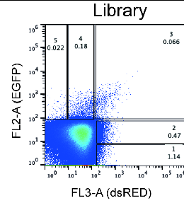

```{r setup, include=FALSE}
knitr::opts_chunk$set(echo = F, message=F, error=F, warning=F)
```

```{r lib, echo=F}
library(tidyverse)
library(furrr)
library(grid)
library(gridExtra)
```
Objectives:  
  - Establish a confident measure of variability to account for splicing noise.  
  - Confident on replicates? Ourtliers? Normalization? 
  - Is there any relationship between splicing variability and the mean value?
  
## Files  

Loading .tsv files (one for each gate) with number of counts  for each promoter in each replicate 

```{r files}
list.files(path="../Amplicon-seq", pattern = "tsv$", full.names=T)
plan(multisession, workers = 5)
list_gates<-future_map(list.files(path="../Amplicon-Seq",pattern = "tsv$",full.names=T),
                ~read_tsv(.x)%>%rowwise()%>%mutate(tot=sum(c_across(where(is.double)))))
plan(sequential)
names(list_gates)<-seq(1,5)
```

The gates were selected like this by Fiszbein's lab:  


## Overview of counts between gates and replicates

In the first figure we can see the distribution of the counts along each gate.  
In the second one, replicates are considered. These are technical replicates from the PCR and sequencing steps (they all come from the same sorting).   
Cells from all gates were sequenced together, so the difference between gates should be explained mainly by the number of cells in each gate, and not by the library size. [This could be actually verified with data from the citometry].  

```{r overview}
map(list_gates, ~sum(.x$tot))%>%list_c()%>%tibble(.name_repair = "universal")%>%rownames_to_column(var="Gates")%>%rename(counts=".")%>%
  ggplot(aes(Gates,counts))+geom_col(fill="#3FA0FF")+ggtitle("Number of counts per Gate")+theme_bw()

counts_per_rep<-map2(list_gates, names(list_gates),~.x%>%as_tibble()%>%summarise(across(starts_with("rep"), sum))%>%mutate(Gate=as.factor(.y)))%>%list_rbind()%>%
     pivot_longer(where(is.double), names_to="rep", values_to="counts")
counts_per_rep%>%
     ggplot(aes(Gate, counts))+geom_violin()+
  geom_point(aes(col=rep), size=2)+
  ggtitle("Number of counts per Gate")+
  scale_color_brewer(palette = "Set1", type="qual")+theme_bw()
```
  
  
To establish whether replicates are coherent between them, the proportion of counts in each gate was assessed, observing high consistency (first Fig) [chi-square test could be done].  
Moreover, the distribution of counts for each gate was plotted. We observe that the small difference between replicates, are mainly reduced when counts are normalized by the total counts in each library (second Fig).  

```{r gate_prop}
counts_per_rep%>%ggplot(aes(rep, counts, fill=Gate))+geom_col(position = "fill")+scale_fill_brewer(palette ="Set1",type="qual")+ theme_bw()+xlab("Replicate")+ggtitle("Gate distribution along replicates")
```

```{r per_gate_rep_distribution, fig.height=10}
min_range_raw=c()
max_range_raw=c()
min_range_norm=c()
max_range_norm=c()
raw_plots<-list()
norm_plots<-list()
for(i in 1:5){
  tots<-counts_per_rep%>%filter(Gate==i)
  a<-list_gates[[i]]%>%pivot_longer(starts_with("rep"), values_to = "counts_rep",names_to = "Replicates")%>%left_join(tots, by=c("Replicates"="rep"))%>%
    mutate(counts_rep_norm=counts_rep/counts, counts_tot_norm=tot/counts)
  min_range_raw<-min(min_range_raw,a$counts_rep)
  max_range_raw<-max(max_range_raw, a$counts_rep)
  min_range_norm<-min(min_range_norm,a$counts_rep_norm)
  max_range_norm<-max(max_range_norm, a$counts_rep_norm)
  plot_norm<-a%>%ggplot(aes(counts_rep_norm, fill=Replicates))+geom_density(alpha=0.7)+ggtitle(paste0("Gate ",i, ": Normalized"))+scale_color_brewer(palette = "Set1", type="qual")+theme_bw()+theme(legend.position = "none", plot.title = element_text(size = 10), axis.title = element_text(size=7))+xlab("Normalized Counts")
  #assign(paste0("density_norm_gate",i), plot_norm, envir = parent.frame())
  norm_plots[[i]]<-plot_norm
  plot<-a%>%ggplot(aes(counts_rep, fill=Replicates))+geom_density(alpha=0.7)+ggtitle(paste0("Gate ",i, ": Raw"))+scale_color_brewer(palette = "Set1", type="qual")+theme_bw()+theme(legend.position = "none", plot.title = element_text(size = 10), axis.title = element_text(size=7))+xlab("Raw Counts")
  #assign(paste0("density_raw_gate",i), plot, envir = parent.frame())
  raw_plots[[i]]<-plot
}
raw_plots<-map(raw_plots, ~.x+xlim(min_range_raw, max_range_raw)+scale_x_log10())
norm_plots<-map(norm_plots, ~.x+xlim(min_range_norm, max_range_norm)+scale_x_log10())

legend_plot<-plot_norm+theme(legend.position="bottom")
extract_legend <- function(my_ggp) {
  step1 <- ggplot_gtable(ggplot_build(my_ggp))
  step2 <- which(sapply(step1$grobs, function(x) x$name) == "guide-box")
  step3 <- step1$grobs[[step2]]
  return(step3)
}
shared_legend <- extract_legend(legend_plot)
grid.arrange(grobs=c(raw_plots, norm_plots, list(shared_legend)),layout_matrix=matrix(c(1:5,11,6:10,11), ncol=2, byrow = F))
```


[Lo unico que faltaria es determinar la variabilidad entre replicas para cada promotor. Hacerlo como variabilidad en counts entre replicas para cada gate (normalizado)? O hacerlo como variabilidad entre las distribuciones (se complica mas pero tal vez es lo adecuado)?]

## Distribution of promoter counts

```{r long}
long_df<-map(seq(1,5),~list_gates[[.x]]%>%select(seqname, tot)%>%mutate(gate=as.factor(.x)))%>%list_rbind()

long_df%>%
  ggplot(aes(tot,fill=gate))+geom_density(alpha=0.5)+scale_x_log10()+scale_fill_brewer(palette="Set1", type="qual")+theme_bw()+ggtitle("Counts per sequence")

long_df%>%group_by(seqname)%>%summarise(suma=sum(tot))%>%ggplot(aes(suma))+geom_density(fill="#3FA0FF")+scale_x_log10()+
  ggtitle("Total counts per sequence")+ theme_bw()+xlab("Counts")
```

## Measuring variability for each promoter  

```{r stats}
get_stats<-function(df){
  k<-length(df$tot[df$tot!=0])
  df$gate<-as.numeric(df$gate)
  a<-sum(df$tot)
  vctr<-map(1:length(unique(df$gate)), ~rep(df$gate[.x],times=df$tot[.x]))%>%list_c()
  if(k==1){extropy=0}else{
      extropy=(-1/((k-1)*log(k/(k-1))))*sum((1-df$tot/a)*log(1-df$tot/a))
  }
  mean=mean(vctr)
  median=median(vctr)
  sd=sd(vctr)
  mad=mad(vctr, constant=1)
  sum=a
  if(k!=5){
    vctr<-c(vctr,seq(1,5)[!seq(1,5)%in%df$gate])
    a=sum(a, 5-length(unique(df$gate)))}
  entropy=(-1/log(5))*sum(df$tot/a*log(df$tot/a))
  return(data.frame(seqname=unique(df$seqname),positive_gates=k,sum,mean,median, sd,mad, entropy, extropy))
}

plan(multisession, workers = availableCores()-2)
list_stats<-future_map(unique(long_df$seqname), ~long_df[long_df$seqname==.x,]%>%get_stats(), .progress = T)%>%list_rbind()
kableExtra::kable(head(list_stats))
```
  
<br>
<br>
  
Many measures for variability has been considered.  
  
The main thing to have in mind to consider one of them is that in this experiment, the values are discrete and ordered (between 1 and 5). Moreover, the number of them is very short.  
  
Therefore, Median Absolute Deviation (a robust measure for variability), cannot be considered. If used, probably all the promoters would have the same values (1, or at least 2).  
  
Entropy (based on Information Theory) may be used, though it doesn't consider the order of the values. It can be normalized and adjusted to the number of bins considered. A major problem is that entropy does not allow for zeros in any bin. To solve this problem, a pseudocount of 1 was added for bins with null counts. In light of the density plot of total counts per promoter, this small pseudocount shouldn't alter the results  
  
Another version of entropy is extropy, which is similar to entropy, but some changes allowing the inclusion of bins with zero counts.On the other hand situation where just one bin concentrates all the counts, can't be calculated (although this cases are rather trivial).   
  
Concerning Standard Deviation, it could also be used (without any normalization). It would capture the ordered nature of the data. Moreover, variance can be weighted if the prior probabilities of a cell to be in one bin is different from the others.     


```{r stats_plots_density}
grid.arrange(grobs=list(
list_stats%>%ggplot(aes(extropy))+geom_density(fill="#3FA0FF", alpha=0.7)+theme_bw()+xlab("Extropy"),
list_stats%>%ggplot(aes(sd))+geom_density(fill="#3FA0FF", alpha=0.7)+theme_bw()+xlab("Standard Deviation"),
list_stats%>%ggplot(aes(floor(median)))+geom_histogram()+theme_bw()+xlab("Median bin"),
list_stats%>%ggplot(aes(mean))+geom_density(fill="#3FA0FF", alpha=0.7)+theme_bw()+xlab("Mean bin")),
nrow=2,ncol=2)
```

## Association between variables  

First. I compare the distribution of extropy and standard deviation for promoters with different medians.  


```{r assoction1, fig.width=10}
seqnames<-map(list_gates, ~.x%>%select(seqname, type))%>%list_rbind()%>%unique()
list_stats<-left_join(list_stats, seqnames, by="seqname")%>%mutate(median=as.factor(floor(median)))
grid.arrange(grobs=list(list_stats%>%ggplot(aes(extropy, fill=median))+geom_density(alpha=0.7)+theme_bw()+ggtitle("Extropy"),
                               list_stats%>%ggplot(aes(sd, fill=median))+geom_density(alpha=0.7)+theme_bw()+ggtitle("Standard Deviation")),ncol=2, top=grid::grid.text("Dispersion distribution for promoters with different median values"))
```

Second. 

```{r}
list_stats%>%ggplot(aes(median, fill=type))+geom_histogram(position = "fill",stat="count")+theme_bw()+ggtitle("Gate proportions for different promoter types")
```


Third

```{r,fig.width=10}
grid.arrange(grobs=list(list_stats%>%ggplot(aes(extropy, fill=type))+geom_density(alpha=0.7)+theme_bw(),
                               list_stats%>%ggplot(aes(sd, fill=type))+geom_density(alpha=0.7)+theme_bw()),ncol=2, top=grid::grid.text("Dispersion distribution for different promoter types"))
```

Fourth. Wilcoxon no significativo

```{r}
list_stats%>%filter(type%in%c("cancer-promoter-wt","cancer-promoter-mut"))%>%ggplot(aes(extropy, fill=type))+geom_density(alpha=0.7)+theme_bw()+ggtitle("Dispersion distribution for cancer-associated promoters")
```
